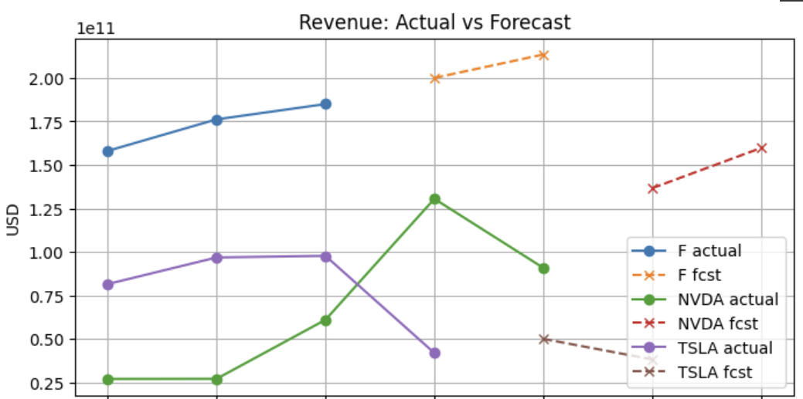

# SEC Financial Analysis

Comparative financial analysis of **Tesla (TSLA)**, **Nvidia (NVDA)**, and **Ford (F)** using SEC EDGAR filings and Python.

---

## Project Overview
This project demonstrates an end-to-end pipeline to extract, clean, and analyze financial data from the **SEC EDGAR API** and **Yahoo Finance**.  
It focuses on:
- Automating SEC data collection  
- Cleaning inconsistent financial keys  
- Calculating financial ratios (PE, PEG, EBITDA margin, Debt-to-Equity, etc.)  
- Comparing 3 companies with different industry contexts  

---

## Tech Stack
- **Python** (pandas, numpy, matplotlib, requests)  
- **Google Colab / Jupyter Notebook**  
- **SEC EDGAR API** (company facts endpoint)  
- **Yahoo Finance** (stock price data)  

---

## Key Features
- Automated SEC API integration with fallback logic  
- Revenue growth (CAGR) and profitability ratios  
- Valuation metrics (PE, PEG) with error handling  
- Comparison dashboards across Tesla, Nvidia, and Ford  
- Exportable CSV and PDF report  

---

## How to Run

1. Clone the repo

```bash
git clone https://github.com/zzeng507/sec-financial-analysis.git
cd sec-financial-analysis
```

## A detailed PDF report and the full Jupyter Notebook are included in the repository for further review.

## Key Findings & Results

### Revenue & Growth
- **Nvidia (NVDA)**: Fastest revenue growth, peaking at ~$130B in 2025 before a slight dip.  
- **Tesla (TSLA)**: Strong earlier growth but sharp decline in 2025, showing volatility.  
- **Ford (F)**: Stable and steady upward trend, consistent with a mature automaker.
- **Revenue by Year**
 


---

### Profitability (EBITDA Margin)
- **Nvidia**: Industry-leading margins, climbing above 60% in 2025.  
- **Tesla**: Margins hovered around 10%, showing positive but limited profitability.  
- **Ford**: Margins remained under 10%, typical for legacy automakers.  


---

### Valuation (P/E and PEG)
- **Nvidia**: P/E ~95, PEG ~268 → expensive, but partially justified by strong growth.  
- **Tesla**: P/E ~939, PEG not meaningful due to negative CAGR.  
- **Ford**: Reported a net loss, so valuation ratios were not reliable.
- **Revenue Forecast**


## Suggestions & Insights

> This section summarizes practical takeaways for non-technical readers (investors, hiring managers) and how technical users can extend the analysis.

### For Investors
- **Nvidia (NVDA)** – Strong multi-year revenue growth and expanding EBITDA margin. Valuation (high PE/PEG) implies a **premium for growth**; fit for growth-oriented, higher-risk profiles.
- **Ford (F)** – Stable top-line with thinner margins typical of autos. Potential fit for **income/risk-averse** investors who value stability and dividends over hypergrowth.
- **Tesla (TSLA)** – Revenue/margin volatility suggests **execution risk** and sensitivity to pricing/competition. Possible **turnaround or momentum** play; monitor margins and delivery trends closely.

**Watch items**
- Track **margin trend** (EBITDA / Gross) vs. peers.
- Compare **PE/PEG** to each company’s own history, not only cross-sectional peers.
- Re-check conclusions each quarter (new 10-K/10-Q can change the picture).

---

### For Users / Analysts
- The notebook is **modular**: replace `TICKERS = ["F","NVDA","TSLA"]` with any U.S. tickers to rerun the workflow.
- Plots (Revenue, EBITDA margin, simple forecast) are designed for **slide-ready** export.
- All metrics are derived from **SEC EDGAR company facts** + **latest price**; you can add more ratios (ROE, ROA, FCF, D/E) in the metrics block.

---

### How to Extend (Ideas)
- Add **Free Cash Flow** (CFO – CapEx) and **FCF margin** once CapEx is available; include **CapEx intensity** (CapEx/Revenue).
- Layer in **valuation bands** (5-yr min/median/max PE) to contextualize current pricing.
- Automate a **quarterly refresh** (GitHub Actions / cron) to pull new filings and rebuild charts.
- Broaden the peer set (e.g., **GM, TM, HMC**) for more robust automotive comparisons.

---

### Caveats / Disclaimer
- EDGAR tagging can vary by issuer; the pipeline prefers `us-gaap:Revenues` but falls back if needed. Always **inspect keys** for edge cases.
- Valuation metrics (PE/PEG) depend on **current prices** and can change daily.
- This project is for **educational / informational** purposes only and is **not investment advice**.

---

### Contact
Questions or ideas? Open an **Issue** or reach me at `zzeng507@gmail.com`.


