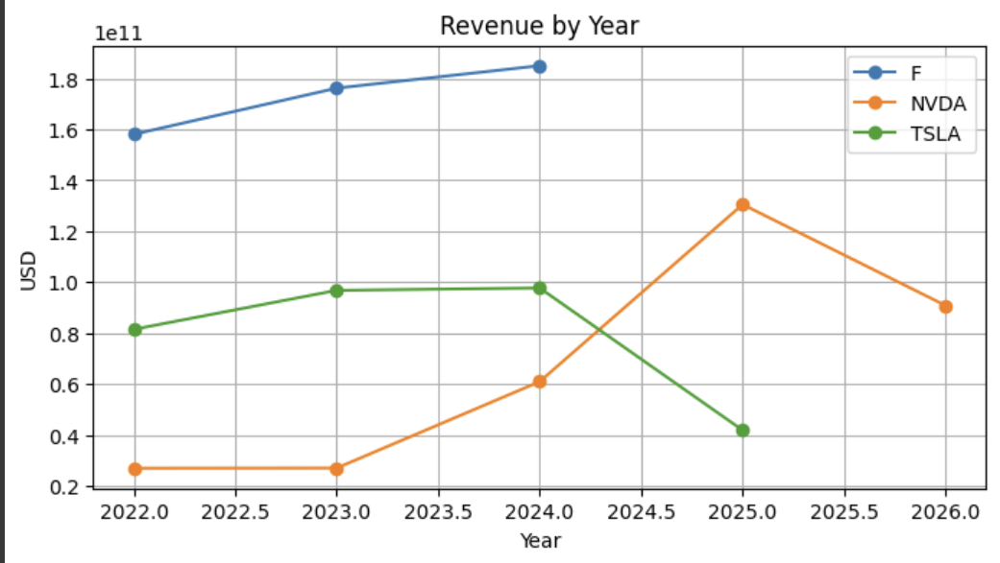
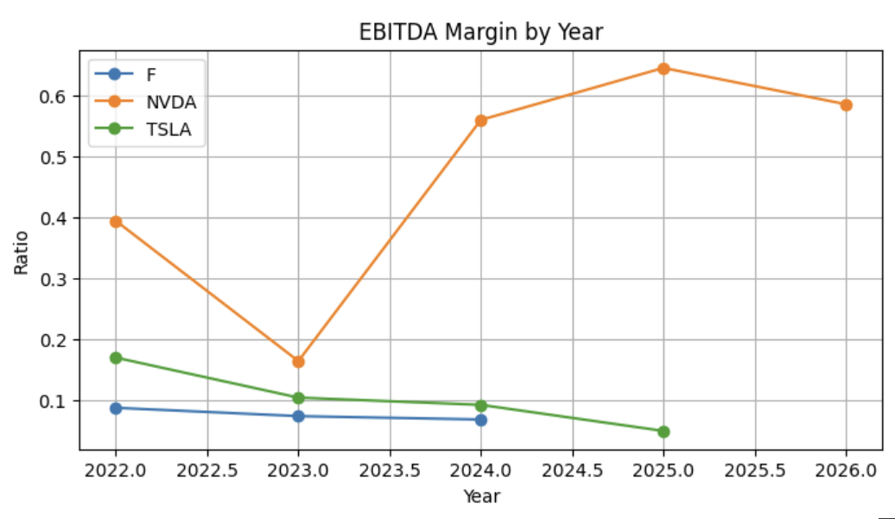

# SEC Financial Analysis

Comparative financial analysis of **Tesla (TSLA)**, **Nvidia (NVDA)**, and **Ford (F)** using SEC EDGAR filings and Python.

---

## Project Overview
This project demonstrates an end-to-end pipeline to extract, clean, and analyze financial data from the **SEC EDGAR API** and **Yahoo Finance**.  
It focuses on:
- Automating SEC data collection  
- Cleaning inconsistent financial keys  
- Calculating financial ratios (PE, PEG, EBITDA margin, Debt-to-Equity, etc.)  
- Comparing 3 companies with different industry contexts  

---

## Tech Stack
- **Python** (pandas, numpy, matplotlib, requests)  
- **Google Colab / Jupyter Notebook**  
- **SEC EDGAR API** (company facts endpoint)  
- **Yahoo Finance** (stock price data)  

---

## Key Features
- Automated SEC API integration with fallback logic  
- Revenue growth (CAGR) and profitability ratios  
- Valuation metrics (PE, PEG) with error handling  
- Comparison dashboards across Tesla, Nvidia, and Ford  
- Exportable CSV and PDF report  

---

## How to Run

1. Clone the repo

```bash
git clone https://github.com/zzeng507/sec-financial-analysis.git
cd sec-financial-analysis
```

## A detailed PDF report and the full Jupyter Notebook are included in the repository for further review.

## Key Findings & Results

### Revenue & Growth
- **Nvidia (NVDA)**: Fastest revenue growth, peaking at ~$130B in 2025 before a slight dip.  
- **Tesla (TSLA)**: Strong earlier growth but sharp decline in 2025, showing volatility.  
- **Ford (F)**: Stable and steady upward trend, consistent with a mature automaker.
- **Revenue by Year**
 


---

### Profitability (EBITDA Margin)
- **Nvidia**: Industry-leading margins, climbing above 60% in 2025.  
- **Tesla**: Margins hovered around 10%, showing positive but limited profitability.  
- **Ford**: Margins remained under 10%, typical for legacy automakers.  



---

### Valuation (P/E and PEG)
- **Nvidia**: P/E ~95, PEG ~268 → expensive, but partially justified by strong growth.  
- **Tesla**: P/E ~939, PEG not meaningful due to negative CAGR.  
- **Ford**: Reported a net loss, so valuation ratios were not reliable.
- **Revenue Forecast**


